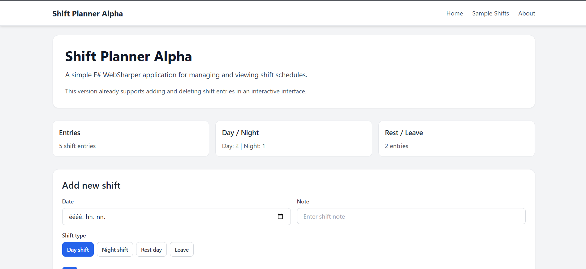
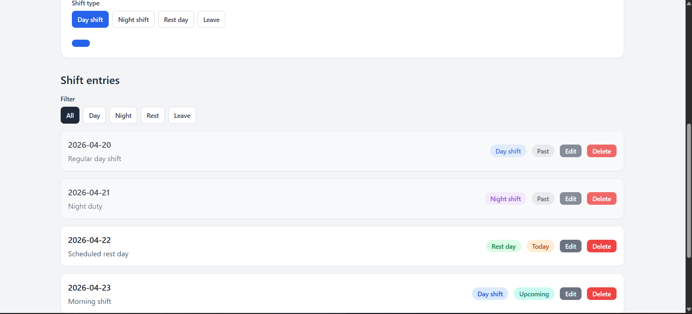

# Shift Planner Alpha

Shift Planner Alpha is a simple F# WebSharper single-page application created as a semester project.

## Motivation

The goal of the project was to build a small but useful shift planning application in F# using WebSharper SPA principles.

## Features

- Add new shift entries
- Edit existing entries
- Delete entries with confirmation
- Filter shifts by type
- View statistics
- Date status badges (Past / Today / Upcoming)

## Technologies

- F#
- WebSharper
- SPA
- Tailwind CSS

## How to run

dotnet run
Look for a localhost link in the terminal

## Live try demo

https://bjulianna99.github.io/shift-planner-alpha/

## Screenshot

